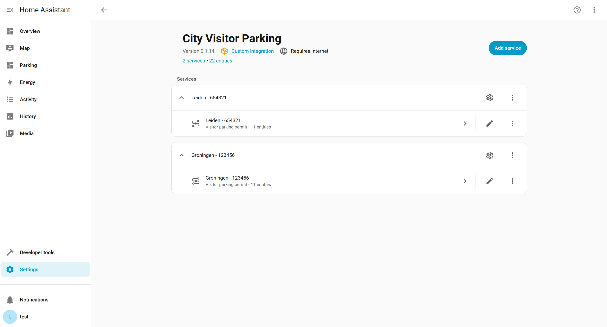
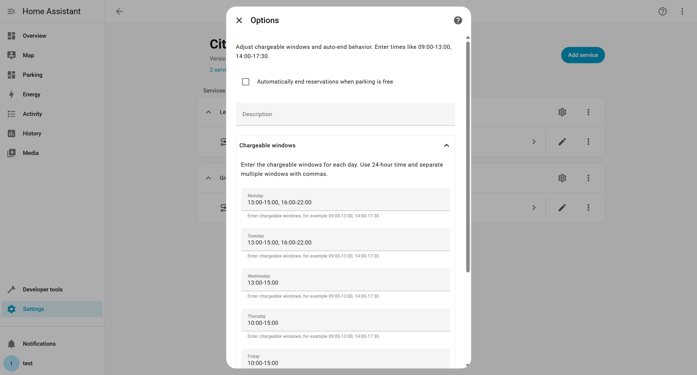
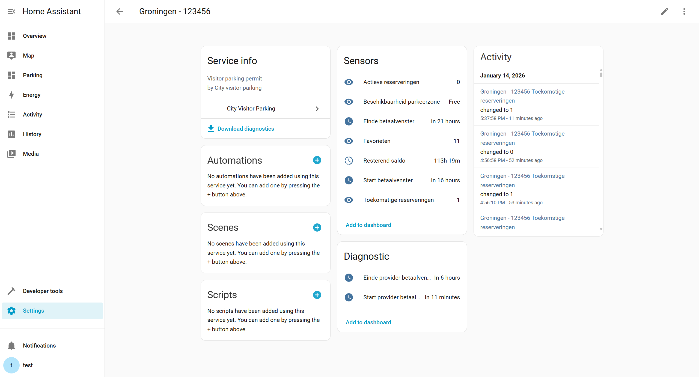
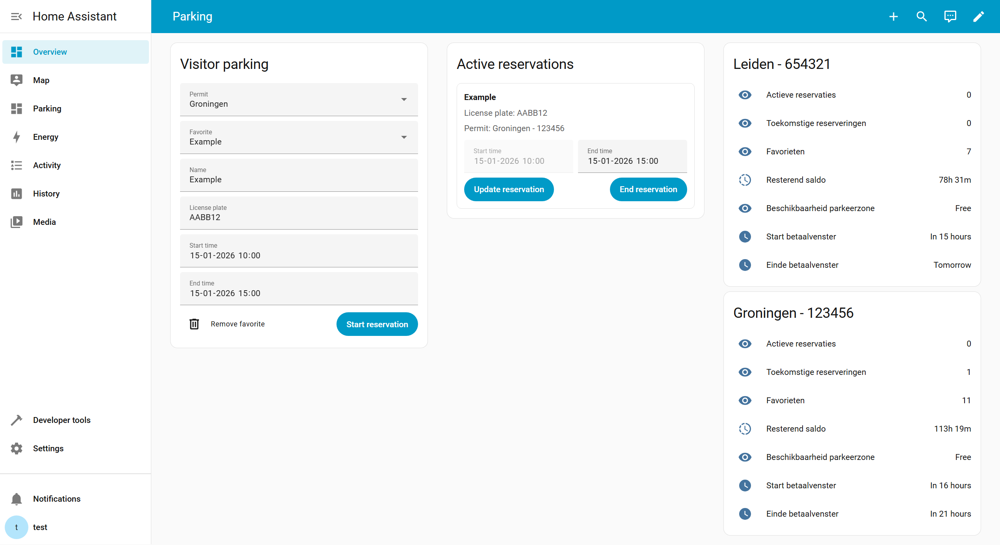
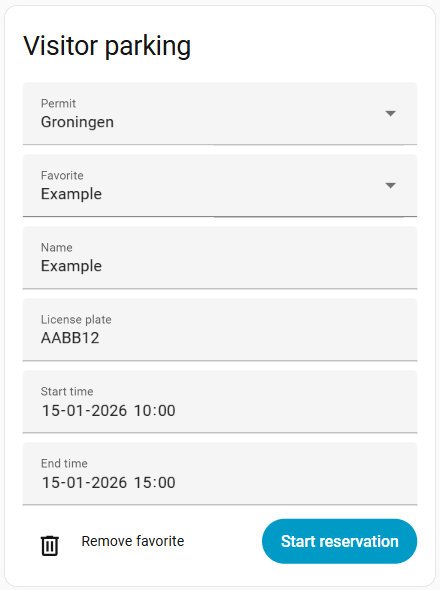
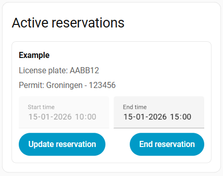

# City Visitor Parking 🚗

[](https://my.home-assistant.io/redirect/hacs_repository/?owner=sir-Unknown&repository=ha_City-Visitor-Parking&category=integration)

Manage Dutch municipality visitor parking permits from Home Assistant. Start, update, and end sessions, see paid or free status, and keep favorite license plates ready.

## Screenshots

<p align="center">
  
  
  
</p>
<p align="center">
  
  
</p>
<p align="center">
  
  
</p>

## Documentation

- English: [docs/README.md](docs/README.md)
- Nederlands: [docs/nl/README.md](docs/nl/README.md)
- Library: [pyCityVisitorParking](https://github.com/sir-Unknown/pyCityVisitorParking)
- Library README: [pyCityVisitorParking README](https://github.com/sir-Unknown/pyCityVisitorParking#readme)
- PyPI: [pycityvisitorparking](https://pypi.org/project/pycityvisitorparking/)

Quick links:
- Lovelace cards: [docs/cards.md](docs/cards.md)
- Services: [docs/services.md](docs/services.md)
- Troubleshooting: [docs/troubleshooting.md](docs/troubleshooting.md)
- Privacy: [docs/privacy.md](docs/privacy.md)
- Examples: [docs/examples/automations.md](docs/examples/automations.md)

## Installation

### Install with HACS

1. Add this repository in HACS as a custom repository (category: Integration).
2. Install **City Visitor Parking**.
3. Restart Home Assistant.

### Install manually

1. Copy `custom_components/city_visitor_parking/` to your Home Assistant `custom_components/` folder.
2. Restart Home Assistant.

Minimum supported Home Assistant version is defined in `custom_components/city_visitor_parking/manifest.json`.

## Configuration

1. Go to **Settings** > **Devices & services**.
2. Select **Add integration**.
3. Search for **City Visitor Parking**.
4. Select your municipality, sign in, and select your permit.
5. Optional: Set a description to distinguish multiple entries.

To add multiple permits, add the integration multiple times.

## Use cases

- Start a visitor parking session from a dashboard card or an automation.
- Update/extend a running session when plans change.
- End a session manually or automatically when parking becomes free.
- Monitor paid/free status and remaining balance.
- Use favorites to quickly select license plates.

## Supported devices and services

This integration connects to municipality visitor parking portals (service providers).

Supported providers are defined in:
- `custom_components/city_visitor_parking/providers.yaml`

Supported municipalities (from `providers.yaml`):
- Apeldoorn
- Bloemendaal
- Delft
- Den Haag
- 's-Hertogenbosch
- Doetinchem (via Buha)
- Groningen
- Haarlem
- Harlingen
- Heemstede
- Heerenveen
- Heerlen
- Hengelo
- Katwijk
- Leiden
- Leidschendam-Voorburg
- Middelburg
- Nissewaard
- Oldenzaal
- Rijswijk
- Roermond
- Schouwen-Duiveland
- Sittard-Geleen
- Smallingerland
- Súdwest-Fryslân
- Veere
- Venlo
- Vlissingen
- Waadhoeke
- Waalwijk
- Weert
- Zaanstad
- Zevenaar
- Zutphen
- Zwolle

If your municipality/provider is missing, open an issue and include your municipality name and permit type (no credentials).

## Supported functionality

- Authenticate with the provider portal.
- List and select permits.
- Start, update, and end sessions.
- Manage favorites (add, update, remove).
- List favorites and active reservations for automations.
- Create sensors for status and balance.

## Known limitations

- Paid/free status is based on the configured paid time windows.
- Available service fields can differ per municipality/provider.
- `update_reservation` may not be available for every provider or may have provider-specific constraints.
- Provider portals can change without notice, which can break sign-in or session actions.

## Data update

- Data is refreshed periodically to keep sensors and session state up to date.
- Home Assistant will refresh after service calls (start/update/end) so changes show quickly.

The exact polling interval is defined in the integration and may vary by provider and Home Assistant scheduling.

## Options

- Paid time windows  
  Define paid parking windows per weekday. Format: `HH:MM-HH:MM`. Multiple windows: `09:00-13:00, 14:00-17:30`.

- Auto-end when free  
  End an active session automatically when parking becomes free.

- Description  
  Rename the config entry as shown in the UI.

## Entities

Entities are created per config entry. Find them via **Settings** > **Devices & services** > **City Visitor Parking** > your entry.

Typical sensors:
- Active sessions
- Remaining balance
- Paid or free (including next change time)
- Paid window start and paid window end
- Favorites (count)

## Lovelace cards

Cards are optional.

Minimal example:

```yaml
type: custom:city-visitor-parking-card
title: Visitor parking
```

If you use YAML dashboards, add these as `module` resources:
- `/city_visitor_parking/city-visitor-parking-card.js`
- `/city_visitor_parking/city-visitor-parking-active-card.js`

More details: [docs/cards.md](docs/cards.md)

## Services

This integration provides services for automations and scripts.
See: [docs/services.md](docs/services.md)

## Privacy

See: [docs/privacy.md](docs/privacy.md)

## Troubleshooting

See: [docs/troubleshooting.md](docs/troubleshooting.md)

## Support

When opening an issue, include:
- Home Assistant version
- Integration version
- Municipality and permit type (no credentials)
- Steps to reproduce and expected result
- Relevant debug log excerpt
- Diagnostics (redacted)
